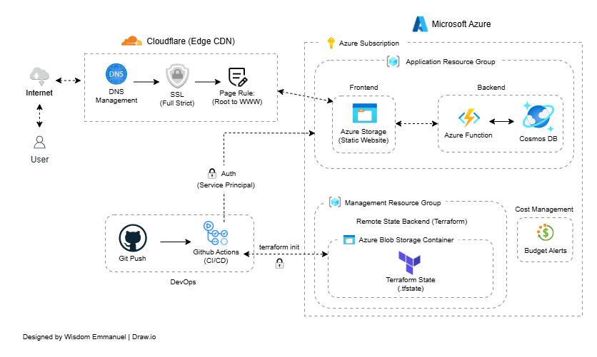

# Cloud Resume Challenge — Azure Edition

> A production-grade, cost efffective serverless resume hosted on Azure — built with intentional engineering, infrastructure as code, and a fully automated CI/CD pipeline. Live at [wisdomresume.site](https://wisdomresume.site)

---

## Table of Contents

- [Project Overview](#project-overview)
- [Live Demo](#live-demo)
- [Architecture](#architecture)
- [Tech Stack](#tech-stack)
- [Features](#features)
- [Project Structure](#project-structure)
- [Getting Started](#getting-started)
- [Infrastructure as Code](#infrastructure-as-code)
- [CI/CD Pipeline](#cicd-pipeline)
- [Cost](#cost)
- [Key Engineering Decisions](#key-engineering-decisions)
- [Lessons Learned](#lessons-learned)
- [What's Next](#whats-next)
- [Author](#author)

---

## Project Overview

This project is my implementation of the [Cloud Resume Challenge by Forrest Brazeal (Azure Edition)](https://cloudresumechallenge.dev/docs/the-challenge/azure/) — a hands-on engineering challenge that covers the full cloud engineering lifecycle: frontend hosting, serverless backend, database integration, infrastructure as code, and CI/CD automation.

> 📖 **Full write-up:** [Read the blog post](https://kloudwiz.hashnode.dev/building-a-cost-efficient-serverless-resume-on-azure) for a deep dive into the architectural decisions, challenges, and lessons learned throughout this build.

---

## Live Demo

🌐 **[wisdomresume.site](https://wisdomresume.site)**

---

## Architecture


*Figure 1.0: The end-to-end serverless architecture for wisdomresume.site.*

The system is composed of the following layers:

```
Visitor's Browser
      │
      ▼
  Cloudflare (CDN, SSL, WAF, Edge Redirects)
      │
      ▼
  Azure Storage Account (Static Website — Frontend)
      │
      ▼
  Azure Function App (Python — Serverless Backend API)
      │
      ▼
  Azure Cosmos DB (NoSQL — Visitor Counter Persistence)
```

**Infrastructure Management:**
```
Terraform (IaC) ──► Azure Blob Storage (Remote State Backend)
GitHub Actions (CI/CD) ──► Azure + Cloudflare
```

---

## Tech Stack

| Layer | Technology |
|---|---|
| Frontend | HTML, CSS, JavaScript |
| Static Hosting | Azure Storage Account (Static Website) |
| CDN, SSL & DNS | Cloudflare (Free Tier) |
| Domain Registrar | Namecheap |
| Backend API | Azure Function App (Python) |
| Database | Azure Cosmos DB (NoSQL — Core SQL API) |
| Infrastructure as Code | Terraform |
| Terraform Remote State Backend | Azure Blob Storage |
| CI/CD | GitHub Actions |
| Cost Management | Azure Budgets |
| CLI Tooling | Azure CLI |

---

## Features

- **Resume Website** — Clean, responsive resume rendered as a static website
- **Live Visitor Counter** — Real-time visitor tracking powered by a serverless backend and Cosmos DB
- **HTTPS & Custom Domain** — Served over HTTPS via Cloudflare SSL Full (Strict) on a custom domain
- **Global CDN** — Content delivered via Cloudflare's global edge network
- **Serverless Backend** — Azure Function App handles all API logic with zero server management
- **Infrastructure as Code** — Every resource defined and managed in Terraform
- **Automated CI/CD** — GitHub Actions pipeline with targeted path-based deployments
- **Zero Operational Cost** — Entire stack running at $0/month

---

## Project Structure

```
cloud-resume-challenge-azure/
│
├── .github/
│   └── workflows/
│       ├── api-deploy.yml         # Backend deployment pipeline
│       └── frontend-deploy.yml  # Frontend deployment pipeline         
│
├── frontend/
│   ├── index.html               # Resume HTML
│   ├── styles.css               # Styling
|   ├── main.js                  # Resume Website General Javascript
│   └── counter.js               # Visitor counter logic
│
├── api/
│   ├── __init__.py
|   ├── function_app.py          # Azure Function entry point
|   ├── .funcignore              # Excludes files from Function App
|   ├── requirements.txt         # Python package dependencies
|   ├── src/
│   |   ├── __init__.py  
│   |   └── visitors_service.py  # Counter business logic
|   └── tests/
|       └── test_visitors.py     #Backend unit tests
│
├── infra/
│   └── terraform/
│       ├── main.tf              # All resource definitions
│       └── .terraform.lock.hcl  # Provider version lock
│
├── tests/
│   └── test_visitors.py         # Backend unit tests
│
├── pytest.ini                   # Pytest configuration
└── README.md
```

---

## Getting Started

### Prerequisites

Ensure the following are installed and configured:

- [Azure CLI](https://learn.microsoft.com/en-us/cli/azure/install-azure-cli)
- [Terraform](https://developer.hashicorp.com/terraform/install) (v1.5+)
- [Python 3.10.x](https://www.python.org/downloads/)
- [Azure Functions Core Tools](https://learn.microsoft.com/en-us/azure/azure-functions/functions-run-local)
- An active Azure Subscription
- A Cloudflare account
- A custom domain

---

### 1. Clone the Repository

```bash
git clone https://github.com/kloud-wiz/cloud-resume-challenge-azure.git
cd cloud-resume-challenge-azure
```

---

### 2. Deploy Infrastructure with Terraform

```bash
cd infra/terraform

# Initialise Terraform and connect to remote backend
terraform init

# Preview changes
terraform plan

# Deploy all resources
terraform apply
```

---

### 3. Deploy the Backend

```bash
cd api

# Install dependencies
pip install -r requirements.txt

# Run tests
pytest -q

# Deploy to Azure
func azure functionapp publish <your-function-app-name>
```

---

### 4. Deploy the Frontend

```bash
az storage blob upload-batch \
  --account-name <your-storage-account-name> \
  --destination '$web' \
  --source ./frontend \
  --overwrite true \
  --auth-mode login
```

---

## Infrastructure as Code

All Azure resources are managed using **Terraform**, stored in `infra/terraform/main.tf`.

### Resources Managed by Terraform

- Azure Resource Groups (Management + Application)
- Azure Storage Account (Static Website)
- Azure Function App (Flex Consumption Plan)
- Azure Cosmos DB (NoSQL — Free Tier)
- Azure Blob Storage (Remote State Backend)

### Remote State Backend

Terraform state is stored remotely on **Azure Blob Storage** with versioning enabled — providing state locking, version history, and a source of truth independent of any local machine.

### Two-Tier Resource Group Architecture

| Resource Group | Purpose |
|---|---|
| Management RG | Holds Terraform remote state backend — never touched by deployments |
| Application RG | Holds all functional resume components — where deployments happen |

This separation protects the state backend from accidental deletion during application deployments and provides isolated RBAC boundaries for each layer.

---

## CI/CD Pipeline

The project uses **GitHub Actions** for fully automated deployments.

### Workflows

| Workflow | Trigger | What It Does |
|---|---|---|
| `frontend.yml` | Push to `frontend/**` | Uploads static files to Azure Blob Storage + purges Cloudflare cache |
| `backend.yml` | Push to `api/**` | Runs tests, deploys Function App to Azure |

### Key Pipeline Features

- **Path filters** — only deploys what changed, reducing build time and risk
- **Remote build** — Azure builds Python dependencies natively, eliminating environment mismatches
- **Automated cache purge** — Cloudflare cache is invalidated on every successful deployment
- **Azure AD authentication** — Federated identity replaces static credentials, following least-privilege principles

---

## Cost

This entire project runs at **$0/month** in operational cost.

| Service | Cost |
|---|---|
| Azure Storage Account (Static Website) | Free tier |
| Azure Function App (Flex Consumption) | Free tier |
| Azure Cosmos DB (NoSQL) | Free tier (1 per subscription) |
| Cloudflare CDN + SSL | Free tier |
| GitHub Actions | Free tier |
| **Total** | **$0/month** |

> Azure Budgets are configured with automated email alerts to monitor spend and immediately flag any unexpected charges.

---

## Key Engineering Decisions

**Cloudflare over Azure Front Door**
Azure CDN (Classic) is being retired. Azure Front Door Standard carries a ~$35/month minimum fee. Cloudflare's free tier delivers identical CDN, SSL, and WAF capabilities at $0/month.

**Cosmos DB NoSQL over Table API**
The CRC spec recommends Table API. I chose the NoSQL (Core SQL) API for stronger Terraform AzureRM provider support, better JSON document modelling, and stronger long-term platform alignment.

**Provisioned Throughput over Serverless**
Provisioned Throughput at 400 RU/s provides deterministic, predictable performance with no per-request charges — eliminating billing risk for a project with strict cost constraints.

**Terraform over Bicep**
Terraform's multi-cloud portability means skills developed here transfer directly to AWS and GCP — making it the more strategically valuable choice.

**Config-driven Import (Terraform 1.5+)**
Rather than recreating existing resources (which would forfeit the free-tier Cosmos DB), I used config-driven import to bring live resources under Terraform's declarative control without disruption.

---

## Lessons Learned

- **Control-plane ≠ Data-plane in Azure.** Subscription ownership does not grant data access. Explicit RBAC assignments at the resource level are always required.
- **Check your Terraform provider version first.** Unexpected errors are often compatibility issues, not logic errors.
- **Free tier constraints should shape architecture decisions early.** One free Cosmos DB per subscription is a real limit worth planning around.
- **Remote state is non-negotiable.** A local state file is a single point of failure for your entire infrastructure.
- **Test runner configuration is part of your test infrastructure.** `pytest.ini` with `pythonpath = .` is essential for correct Python import resolution.
- **Isolate your state backend from application resources.** The dual-resource-group pattern protects your source of truth from deployment errors.

---

## Author

**Wisdom Emmanuel** — Associate Cloud/Devops Engineer

🌐 [wisdomresume.site](https://wisdomresume.site)
[GitHub](https://github.com/kloud-wiz)
[Blog](https://https://kloudwiz.hashnode.dev)
[Linkedin](https://linkedin.com/in/wisdom96)

---

> *"Beyond the certs, into the craft."*